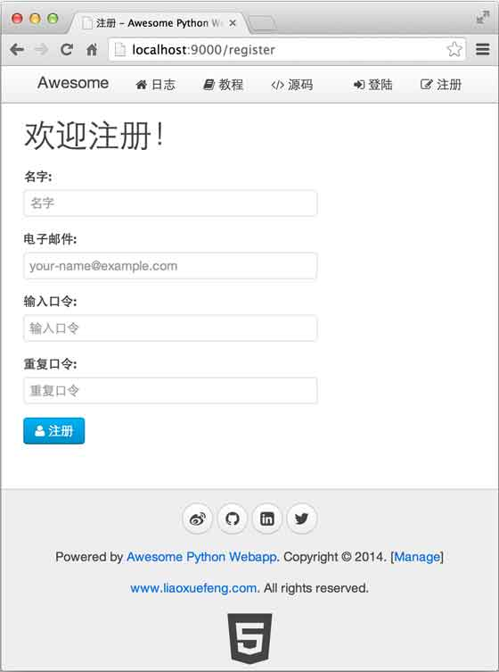

        
用户管理是绝大部分Web网站都需要解决的问题。用户管理涉及到用户注册和登录。

用户注册相对简单，我们可以先通过API把用户注册这个功能实现了：

<pre><code>_RE_EMAIL = re.compile(r&#39;^[a-z0-9\.\-\_]+\@[a-z0-9\-\_]+(\.[a-z0-9\-\_]+){1,4}$&#39;)
_RE_SHA1 = re.compile(r&#39;^[0-9a-f]{40}$&#39;)

@post(&#39;/api/users&#39;)
def api_register_user(*, email, name, passwd):
    if not name or not name.strip():
        raise APIValueError(&#39;name&#39;)
    if not email or not _RE_EMAIL.match(email):
        raise APIValueError(&#39;email&#39;)
    if not passwd or not _RE_SHA1.match(passwd):
        raise APIValueError(&#39;passwd&#39;)
    users = yield from User.findAll(&#39;email=?&#39;, [email])
    if len(users) &gt; 0:
        raise APIError(&#39;register:failed&#39;, &#39;email&#39;, &#39;Email is already in use.&#39;)
    uid = next_id()
    sha1_passwd = &#39;%s:%s&#39; % (uid, passwd)
    user = User(id=uid, name=name.strip(), email=email, passwd=hashlib.sha1(sha1_passwd.encode(&#39;utf-8&#39;)).hexdigest(), image=&#39;http://www.gravatar.com/avatar/%s?d=mm&amp;s=120&#39; % hashlib.md5(email.encode(&#39;utf-8&#39;)).hexdigest())
    yield from user.save()
    # make session cookie:
    r = web.Response()
    r.set_cookie(COOKIE_NAME, user2cookie(user, 86400), max_age=86400, httponly=True)
    user.passwd = &#39;******&#39;
    r.content_type = &#39;application/json&#39;
    r.body = json.dumps(user, ensure_ascii=False).encode(&#39;utf-8&#39;)
    return r
</code></pre>
注意用户口令是客户端传递的经过SHA1计算后的40位Hash字符串，所以服务器端并不知道用户的原始口令。

接下来可以创建一个注册页面，让用户填写注册表单，然后，提交数据到注册用户的API：

<pre><code>

注册



&lt;script&gt;
function validateEmail(email) {
    var re = /^[a-z0-9\.\-\_]+\@[a-z0-9\-\_]+(\.[a-z0-9\-\_]+){1,4}$/;
    return re.test(email.toLowerCase());
}
$(function () {
    var vm = new Vue({
        el: &#39;#vm&#39;,
        data: {
            name: &#39;&#39;,
            email: &#39;&#39;,
            password1: &#39;&#39;,
            password2: &#39;&#39;
        },
        methods: {
            submit: function (event) {
                event.preventDefault();
                var $form = $(&#39;#vm&#39;);
                if (! this.name.trim()) {
                    return $form.showFormError(&#39;请输入名字&#39;);
                }
                if (! validateEmail(this.email.trim().toLowerCase())) {
                    return $form.showFormError(&#39;请输入正确的Email地址&#39;);
                }
                if (this.password1.length &lt; 6) {
                    return $form.showFormError(&#39;口令长度至少为6个字符&#39;);
                }
                if (this.password1 !== this.password2) {
                    return $form.showFormError(&#39;两次输入的口令不一致&#39;);
                }
                var email = this.email.trim().toLowerCase();
                $form.postJSON(&#39;/api/users&#39;, {
                    name: this.name.trim(),
                    email: email,
                    passwd: CryptoJS.SHA1(email + &#39;:&#39; + this.password1).toString()
                }, function (err, r) {
                    if (err) {
                        return $form.showFormError(err);
                    }
                    return location.assign(&#39;/&#39;);
                });
            }
        }
    });
    $(&#39;#vm&#39;).show();
});
&lt;/script&gt;





    &lt;div class=&quot;uk-width-2-3&quot;&gt;
        &lt;h1&gt;欢迎注册！&lt;/h1&gt;
        &lt;form id=&quot;vm&quot; v-on=&quot;submit: submit&quot; class=&quot;uk-form uk-form-stacked&quot;&gt;
            &lt;div class=&quot;uk-alert uk-alert-danger uk-hidden&quot;&gt;&lt;/div&gt;
            &lt;div class=&quot;uk-form-row&quot;&gt;
                &lt;label class=&quot;uk-form-label&quot;&gt;名字:&lt;/label&gt;
                &lt;div class=&quot;uk-form-controls&quot;&gt;
                    &lt;input v-model=&quot;name&quot; type=&quot;text&quot; maxlength=&quot;50&quot; placeholder=&quot;名字&quot; class=&quot;uk-width-1-1&quot;&gt;
                &lt;/div&gt;
            &lt;/div&gt;
            &lt;div class=&quot;uk-form-row&quot;&gt;
                &lt;label class=&quot;uk-form-label&quot;&gt;电子邮件:&lt;/label&gt;
                &lt;div class=&quot;uk-form-controls&quot;&gt;
                    &lt;input v-model=&quot;email&quot; type=&quot;text&quot; maxlength=&quot;50&quot; placeholder=&quot;your-name@example.com&quot; class=&quot;uk-width-1-1&quot;&gt;
                &lt;/div&gt;
            &lt;/div&gt;
            &lt;div class=&quot;uk-form-row&quot;&gt;
                &lt;label class=&quot;uk-form-label&quot;&gt;输入口令:&lt;/label&gt;
                &lt;div class=&quot;uk-form-controls&quot;&gt;
                    &lt;input v-model=&quot;password1&quot; type=&quot;password&quot; maxlength=&quot;50&quot; placeholder=&quot;输入口令&quot; class=&quot;uk-width-1-1&quot;&gt;
                &lt;/div&gt;
            &lt;/div&gt;
            &lt;div class=&quot;uk-form-row&quot;&gt;
                &lt;label class=&quot;uk-form-label&quot;&gt;重复口令:&lt;/label&gt;
                &lt;div class=&quot;uk-form-controls&quot;&gt;
                    &lt;input v-model=&quot;password2&quot; type=&quot;password&quot; maxlength=&quot;50&quot; placeholder=&quot;重复口令&quot; class=&quot;uk-width-1-1&quot;&gt;
                &lt;/div&gt;
            &lt;/div&gt;
            &lt;div class=&quot;uk-form-row&quot;&gt;
                &lt;button type=&quot;submit&quot; class=&quot;uk-button uk-button-primary&quot;&gt;&lt;i class=&quot;uk-icon-user&quot;&gt;&lt;/i&gt; 注册&lt;/button&gt;
            &lt;/div&gt;
        &lt;/form&gt;
    &lt;/div&gt;


</code></pre>
这样我们就把用户注册的功能完成了：

用户登录比用户注册复杂。由于HTTP协议是一种无状态协议，而服务器要跟踪用户状态，就只能通过cookie实现。大多数Web框架提供了Session功能来封装保存用户状态的cookie。

Session的优点是简单易用，可以直接从Session中取出用户登录信息。

Session的缺点是服务器需要在内存中维护一个映射表来存储用户登录信息，如果有两台以上服务器，就需要对Session做集群，因此，使用Session的Web App很难扩展。

我们采用直接读取cookie的方式来验证用户登录，每次用户访问任意URL，都会对cookie进行验证，这种方式的好处是保证服务器处理任意的URL都是无状态的，可以扩展到多台服务器。

由于登录成功后是由服务器生成一个cookie发送给浏览器，所以，要保证这个cookie不会被客户端伪造出来。

实现防伪造cookie的关键是通过一个单向算法（例如SHA1），举例如下：

当用户输入了正确的口令登录成功后，服务器可以从数据库取到用户的id，并按照如下方式计算出一个字符串：

<pre><code>&quot;用户id&quot; + &quot;过期时间&quot; + SHA1(&quot;用户id&quot; + &quot;用户口令&quot; + &quot;过期时间&quot; + &quot;SecretKey&quot;)
</code></pre>
当浏览器发送cookie到服务器端后，服务器可以拿到的信息包括：

<ul>
<li>
用户id

</li>
<li>
过期时间

</li>
<li>
SHA1值

</li>
</ul>

如果未到过期时间，服务器就根据用户id查找用户口令，并计算：

<pre><code>SHA1(&quot;用户id&quot; + &quot;用户口令&quot; + &quot;过期时间&quot; + &quot;SecretKey&quot;)
</code></pre>
并与浏览器cookie中的MD5进行比较，如果相等，则说明用户已登录，否则，cookie就是伪造的。

这个算法的关键在于SHA1是一种单向算法，即可以通过原始字符串计算出SHA1结果，但无法通过SHA1结果反推出原始字符串。

所以登录API可以实现如下：

<pre><code>@post(&#39;/api/authenticate&#39;)
def authenticate(*, email, passwd):
    if not email:
        raise APIValueError(&#39;email&#39;, &#39;Invalid email.&#39;)
    if not passwd:
        raise APIValueError(&#39;passwd&#39;, &#39;Invalid password.&#39;)
    users = yield from User.findAll(&#39;email=?&#39;, [email])
    if len(users) == 0:
        raise APIValueError(&#39;email&#39;, &#39;Email not exist.&#39;)
    user = users[0]
    # check passwd:
    sha1 = hashlib.sha1()
    sha1.update(user.id.encode(&#39;utf-8&#39;))
    sha1.update(b&#39;:&#39;)
    sha1.update(passwd.encode(&#39;utf-8&#39;))
    if user.passwd != sha1.hexdigest():
        raise APIValueError(&#39;passwd&#39;, &#39;Invalid password.&#39;)
    # authenticate ok, set cookie:
    r = web.Response()
    r.set_cookie(COOKIE_NAME, user2cookie(user, 86400), max_age=86400, httponly=True)
    user.passwd = &#39;******&#39;
    r.content_type = &#39;application/json&#39;
    r.body = json.dumps(user, ensure_ascii=False).encode(&#39;utf-8&#39;)
    return r

# 计算加密cookie:
def user2cookie(user, max_age):
    # build cookie string by: id-expires-sha1
    expires = str(int(time.time() + max_age))
    s = &#39;%s-%s-%s-%s&#39; % (user.id, user.passwd, expires, _COOKIE_KEY)
    L = [user.id, expires, hashlib.sha1(s.encode(&#39;utf-8&#39;)).hexdigest()]
    return &#39;-&#39;.join(L)
</code></pre>
对于每个URL处理函数，如果我们都去写解析cookie的代码，那会导致代码重复很多次。

利用middle在处理URL之前，把cookie解析出来，并将登录用户绑定到<code>request</code>对象上，这样，后续的URL处理函数就可以直接拿到登录用户：

<pre><code>@asyncio.coroutine
def auth_factory(app, handler):
    @asyncio.coroutine
    def auth(request):
        logging.info(&#39;check user: %s %s&#39; % (request.method, request.path))
        request.__user__ = None
        cookie_str = request.cookies.get(COOKIE_NAME)
        if cookie_str:
            user = yield from cookie2user(cookie_str)
            if user:
                logging.info(&#39;set current user: %s&#39; % user.email)
                request.__user__ = user
        return (yield from handler(request))
    return auth

# 解密cookie:
@asyncio.coroutine
def cookie2user(cookie_str):
    &#39;&#39;&#39;
    Parse cookie and load user if cookie is valid.
    &#39;&#39;&#39;
    if not cookie_str:
        return None
    try:
        L = cookie_str.split(&#39;-&#39;)
        if len(L) != 3:
            return None
        uid, expires, sha1 = L
        if int(expires) &lt; time.time():
            return None
        user = yield from User.find(uid)
        if user is None:
            return None
        s = &#39;%s-%s-%s-%s&#39; % (uid, user.passwd, expires, _COOKIE_KEY)
        if sha1 != hashlib.sha1(s.encode(&#39;utf-8&#39;)).hexdigest():
            logging.info(&#39;invalid sha1&#39;)
            return None
        user.passwd = &#39;******&#39;
        return user
    except Exception as e:
        logging.exception(e)
        return None
</code></pre>
这样，我们就完成了用户注册和登录的功能。

<h3 id="-">参考源码</h3>

<a href="https://github.com/michaelliao/awesome-python3-webapp/tree/day-10">day-10</a>

    