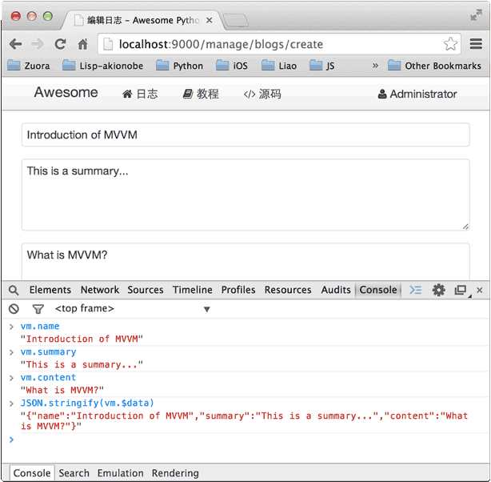

        
在Web开发中，后端代码写起来其实是相当容易的。

例如，我们编写一个REST API，用于创建一个Blog：

<pre><code>@post(&#39;/api/blogs&#39;)
def api_create_blog(request, *, name, summary, content):
    check_admin(request)
    if not name or not name.strip():
        raise APIValueError(&#39;name&#39;, &#39;name cannot be empty.&#39;)
    if not summary or not summary.strip():
        raise APIValueError(&#39;summary&#39;, &#39;summary cannot be empty.&#39;)
    if not content or not content.strip():
        raise APIValueError(&#39;content&#39;, &#39;content cannot be empty.&#39;)
    blog = Blog(user_id=request.__user__.id, user_name=request.__user__.name, user_image=request.__user__.image, name=name.strip(), summary=summary.strip(), content=content.strip())
    yield from blog.save()
    return blog
</code></pre>
编写后端Python代码不但很简单，而且非常容易测试，上面的API：<code>api_create_blog()</code>本身只是一个普通函数。

Web开发真正困难的地方在于编写前端页面。前端页面需要混合HTML、CSS和JavaScript，如果对这三者没有深入地掌握，编写的前端页面将很快难以维护。

更大的问题在于，前端页面通常是动态页面，也就是说，前端页面往往是由后端代码生成的。

生成前端页面最早的方式是拼接字符串：

<pre><code>s = &#39;&lt;html&gt;&lt;head&gt;&lt;title&gt;&#39;
    + title
    + &#39;&lt;/title&gt;&lt;/head&gt;&lt;body&gt;&#39;
    + body
    + &#39;&lt;/body&gt;&lt;/html&gt;&#39;
</code></pre>
显然这种方式完全不具备可维护性。所以有第二种模板方式：

<pre><code>&lt;html&gt;
&lt;head&gt;
    &lt;title&gt;{{ title }}&lt;/title&gt;
&lt;/head&gt;
&lt;body&gt;
    {{ body }}
&lt;/body&gt;
&lt;/html&gt;
</code></pre>
ASP、JSP、PHP等都是用这种模板方式生成前端页面。

如果在页面上大量使用JavaScript（事实上大部分页面都会），模板方式仍然会导致JavaScript代码与后端代码绑得非常紧密，以至于难以维护。其根本原因在于负责显示的HTML DOM模型与负责数据和交互的JavaScript代码没有分割清楚。

要编写可维护的前端代码绝非易事。和后端结合的MVC模式已经无法满足复杂页面逻辑的需要了，所以，新的<a href="http://en.wikipedia.org/wiki/Model_View_ViewModel">MVVM</a>：Model View ViewModel模式应运而生。

MVVM最早由微软提出来，它借鉴了桌面应用程序的MVC思想，在前端页面中，把Model用纯JavaScript对象表示：

<pre><code>&lt;script&gt;
    var blog = {
        name: &#39;hello&#39;,
        summary: &#39;this is summary&#39;,
        content: &#39;this is content...&#39;
    };
&lt;/script&gt;
</code></pre>
View是纯HTML：

<pre><code>&lt;form action=&quot;/api/blogs&quot; method=&quot;post&quot;&gt;
    &lt;input name=&quot;name&quot;&gt;
    &lt;input name=&quot;summary&quot;&gt;
    &lt;textarea name=&quot;content&quot;&gt;&lt;/textarea&gt;
    &lt;button type=&quot;submit&quot;&gt;OK&lt;/button&gt;
&lt;/form&gt;
</code></pre>
由于Model表示数据，View负责显示，两者做到了最大限度的分离。

把Model和View关联起来的就是ViewModel。ViewModel负责把Model的数据同步到View显示出来，还负责把View的修改同步回Model。

ViewModel如何编写？需要用JavaScript编写一个通用的ViewModel，这样，就可以复用整个MVVM模型了。

好消息是已有许多成熟的MVVM框架，例如AngularJS，KnockoutJS等。我们选择<a href="http://vuejs.org/">Vue</a>这个简单易用的MVVM框架来实现创建Blog的页面<code>templates/manage_blog_edit.html</code>：

<pre><code>

编辑日志



&lt;script&gt;
var
    ID = &#39;{{ id }}&#39;,
    action = &#39;{{ action }}&#39;;
function initVM(blog) {
    var vm = new Vue({
        el: &#39;#vm&#39;,
        data: blog,
        methods: {
            submit: function (event) {
                event.preventDefault();
                var $form = $(&#39;#vm&#39;).find(&#39;form&#39;);
                $form.postJSON(action, this.$data, function (err, r) {
                    if (err) {
                        $form.showFormError(err);
                    }
                    else {
                        return location.assign(&#39;/api/blogs/&#39; + r.id);
                    }
                });
            }
        }
    });
    $(&#39;#vm&#39;).show();
}
$(function () {
    if (ID) {
        getJSON(&#39;/api/blogs/&#39; + ID, function (err, blog) {
            if (err) {
                return fatal(err);
            }
            $(&#39;#loading&#39;).hide();
            initVM(blog);
        });
    }
    else {
        $(&#39;#loading&#39;).hide();
        initVM({
            name: &#39;&#39;,
            summary: &#39;&#39;,
            content: &#39;&#39;
        });
    }
});
&lt;/script&gt;





    &lt;div class=&quot;uk-width-1-1 uk-margin-bottom&quot;&gt;
        &lt;div class=&quot;uk-panel uk-panel-box&quot;&gt;
            &lt;ul class=&quot;uk-breadcrumb&quot;&gt;
                &lt;li&gt;&lt;a href=&quot;/manage/comments&quot;&gt;评论&lt;/a&gt;&lt;/li&gt;
                &lt;li&gt;&lt;a href=&quot;/manage/blogs&quot;&gt;日志&lt;/a&gt;&lt;/li&gt;
                &lt;li&gt;&lt;a href=&quot;/manage/users&quot;&gt;用户&lt;/a&gt;&lt;/li&gt;
            &lt;/ul&gt;
        &lt;/div&gt;
    &lt;/div&gt;

    &lt;div id=&quot;error&quot; class=&quot;uk-width-1-1&quot;&gt;
    &lt;/div&gt;

    &lt;div id=&quot;loading&quot; class=&quot;uk-width-1-1 uk-text-center&quot;&gt;
        &lt;span&gt;&lt;i class=&quot;uk-icon-spinner uk-icon-medium uk-icon-spin&quot;&gt;&lt;/i&gt; 正在加载...&lt;/span&gt;
    &lt;/div&gt;

    &lt;div id=&quot;vm&quot; class=&quot;uk-width-2-3&quot;&gt;
        &lt;form v-on=&quot;submit: submit&quot; class=&quot;uk-form uk-form-stacked&quot;&gt;
            &lt;div class=&quot;uk-alert uk-alert-danger uk-hidden&quot;&gt;&lt;/div&gt;
            &lt;div class=&quot;uk-form-row&quot;&gt;
                &lt;label class=&quot;uk-form-label&quot;&gt;标题:&lt;/label&gt;
                &lt;div class=&quot;uk-form-controls&quot;&gt;
                    &lt;input v-model=&quot;name&quot; name=&quot;name&quot; type=&quot;text&quot; placeholder=&quot;标题&quot; class=&quot;uk-width-1-1&quot;&gt;
                &lt;/div&gt;
            &lt;/div&gt;
            &lt;div class=&quot;uk-form-row&quot;&gt;
                &lt;label class=&quot;uk-form-label&quot;&gt;摘要:&lt;/label&gt;
                &lt;div class=&quot;uk-form-controls&quot;&gt;
                    &lt;textarea v-model=&quot;summary&quot; rows=&quot;4&quot; name=&quot;summary&quot; placeholder=&quot;摘要&quot; class=&quot;uk-width-1-1&quot; style=&quot;resize:none;&quot;&gt;&lt;/textarea&gt;
                &lt;/div&gt;
            &lt;/div&gt;
            &lt;div class=&quot;uk-form-row&quot;&gt;
                &lt;label class=&quot;uk-form-label&quot;&gt;内容:&lt;/label&gt;
                &lt;div class=&quot;uk-form-controls&quot;&gt;
                    &lt;textarea v-model=&quot;content&quot; rows=&quot;16&quot; name=&quot;content&quot; placeholder=&quot;内容&quot; class=&quot;uk-width-1-1&quot; style=&quot;resize:none;&quot;&gt;&lt;/textarea&gt;
                &lt;/div&gt;
            &lt;/div&gt;
            &lt;div class=&quot;uk-form-row&quot;&gt;
                &lt;button type=&quot;submit&quot; class=&quot;uk-button uk-button-primary&quot;&gt;&lt;i class=&quot;uk-icon-save&quot;&gt;&lt;/i&gt; 保存&lt;/button&gt;
                &lt;a href=&quot;/manage/blogs&quot; class=&quot;uk-button&quot;&gt;&lt;i class=&quot;uk-icon-times&quot;&gt;&lt;/i&gt; 取消&lt;/a&gt;
            &lt;/div&gt;
        &lt;/form&gt;
    &lt;/div&gt;


</code></pre>
初始化Vue时，我们指定3个参数：

el：根据选择器查找绑定的View，这里是<code>#vm</code>，就是id为<code>vm</code>的DOM，对应的是一个<code>&lt;div&gt;</code>标签；

data：JavaScript对象表示的Model，我们初始化为<code>{ name: &#39;&#39;, summary: &#39;&#39;, content: &#39;&#39;}</code>；

methods：View可以触发的JavaScript函数，<code>submit</code>就是提交表单时触发的函数。

接下来，我们在<code>&lt;form&gt;</code>标签中，用几个简单的<code>v-model</code>，就可以让Vue把Model和View关联起来：

<pre><code>&lt;!-- input的value和Model的name关联起来了 --&gt;
&lt;input v-model=&quot;name&quot; class=&quot;uk-width-1-1&quot;&gt;
</code></pre>
Form表单通过<code>&lt;form v-on=&quot;submit: submit&quot;&gt;</code>把提交表单的事件关联到<code>submit</code>方法。

需要特别注意的是，在MVVM中，Model和View是双向绑定的。如果我们在Form中修改了文本框的值，可以在Model中立刻拿到新的值。试试在表单中输入文本，然后在Chrome浏览器中打开JavaScript控制台，可以通过<code>vm.name</code>访问单个属性，或者通过<code>vm.$data</code>访问整个Model：

如果我们在JavaScript逻辑中修改了Model，这个修改会立刻反映到View上。试试在JavaScript控制台输入<code>vm.name = &#39;MVVM简介&#39;</code>，可以看到文本框的内容自动被同步了：

双向绑定是MVVM框架最大的作用。借助于MVVM，我们把复杂的显示逻辑交给框架完成。由于后端编写了独立的REST API，所以，前端用AJAX提交表单非常容易，前后端分离得非常彻底。

<h3 id="-">参考源码</h3>

<a href="https://github.com/michaelliao/awesome-python3-webapp/tree/day-11">day-11</a>

    