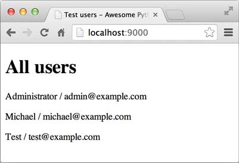


        
现在，ORM框架、Web框架和配置都已就绪，我们可以开始编写一个最简单的MVC，把它们全部启动起来。

通过Web框架的<code>@get</code>和ORM框架的Model支持，可以很容易地编写一个处理首页URL的函数：

<pre><code>@get(&#39;/&#39;)
def index(request):
    users = yield from User.findAll()
    return {
        &#39;__template__&#39;: &#39;test.html&#39;,
        &#39;users&#39;: users
    }
</code></pre>
<code>&#39;__template__&#39;</code>指定的模板文件是<code>test.html</code>，其他参数是传递给模板的数据，所以我们在模板的根目录<code>templates</code>下创建<code>test.html</code>：

<pre><code>&lt;!DOCTYPE html&gt;
&lt;html&gt;
&lt;head&gt;
    &lt;meta charset=&quot;utf-8&quot; /&gt;
    &lt;title&gt;Test users - Awesome Python Webapp&lt;/title&gt;
&lt;/head&gt;
&lt;body&gt;
    &lt;h1&gt;All users&lt;/h1&gt;
    
    &lt;p&gt;{{ u.name }} / {{ u.email }}&lt;/p&gt;
    
&lt;/body&gt;
&lt;/html&gt;
</code></pre>
接下来，如果一切顺利，可以用命令行启动Web服务器：

<pre><code>$ python3 app.py
</code></pre>
然后，在浏览器中访问<code>http://localhost:9000/</code>。

如果数据库的<code>users</code>表什么内容也没有，你就无法在浏览器中看到循环输出的内容。可以自己在MySQL的命令行里给<code>users</code>表添加几条记录，然后再访问：

<h3 id="-">参考源码</h3>

<a href="https://github.com/michaelliao/awesome-python3-webapp/tree/day-07">day-07</a>

    