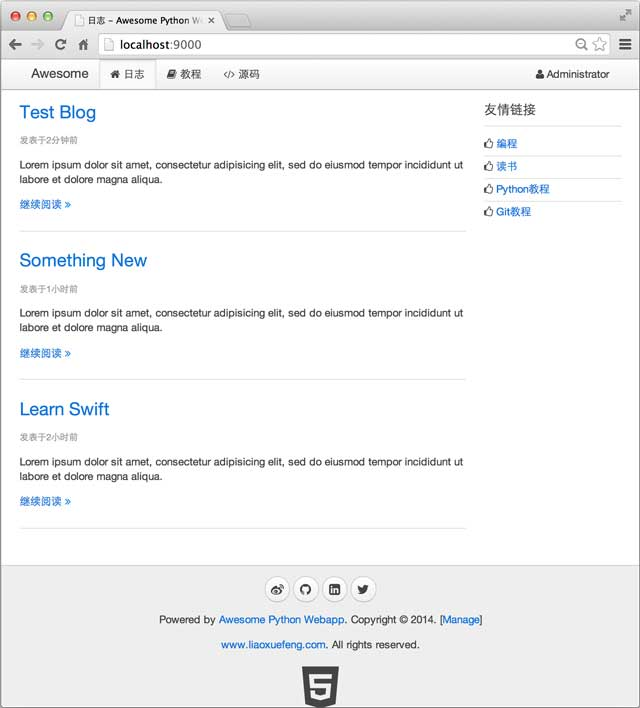


        
虽然我们跑通了一个最简单的MVC，但是页面效果肯定不会让人满意。

对于复杂的HTML前端页面来说，我们需要一套基础的CSS框架来完成页面布局和基本样式。另外，jQuery作为操作DOM的JavaScript库也必不可少。

从零开始写CSS不如直接从一个已有的功能完善的CSS框架开始。有很多CSS框架可供选择。我们这次选择<a href="http://getuikit.com/">uikit</a>这个强大的CSS框架。它具备完善的响应式布局，漂亮的UI，以及丰富的HTML组件，让我们能轻松设计出美观而简洁的页面。

可以从<a href="http://getuikit.com/">uikit首页</a>下载打包的资源文件。

所有的静态资源文件我们统一放到<code>www/static</code>目录下，并按照类别归类：

<pre><code>static/
+- css/
|  +- addons/
|  |  +- uikit.addons.min.css
|  |  +- uikit.almost-flat.addons.min.css
|  |  +- uikit.gradient.addons.min.css
|  +- awesome.css
|  +- uikit.almost-flat.addons.min.css
|  +- uikit.gradient.addons.min.css
|  +- uikit.min.css
+- fonts/
|  +- fontawesome-webfont.eot
|  +- fontawesome-webfont.ttf
|  +- fontawesome-webfont.woff
|  +- FontAwesome.otf
+- js/
   +- awesome.js
   +- html5.js
   +- jquery.min.js
   +- uikit.min.js
</code></pre>
由于前端页面肯定不止首页一个页面，每个页面都有相同的页眉和页脚。如果每个页面都是独立的HTML模板，那么我们在修改页眉和页脚的时候，就需要把每个模板都改一遍，这显然是没有效率的。

常见的模板引擎已经考虑到了页面上重复的HTML部分的复用问题。有的模板通过include把页面拆成三部分：

<pre><code>&lt;html&gt;
    &lt;% include file=&quot;inc_header.html&quot; %&gt;
    &lt;% include file=&quot;index_body.html&quot; %&gt;
    &lt;% include file=&quot;inc_footer.html&quot; %&gt;
&lt;/html&gt;
</code></pre>
这样，相同的部分<code>inc_header.html</code>和<code>inc_footer.html</code>就可以共享。

但是include方法不利于页面整体结构的维护。jinjia2的模板还有另一种“继承”方式，实现模板的复用更简单。

“继承”模板的方式是通过编写一个“父模板”，在父模板中定义一些可替换的block（块）。然后，编写多个“子模板”，每个子模板都可以只替换父模板定义的block。比如，定义一个最简单的父模板：

<pre><code>&lt;!-- base.html --&gt;
&lt;html&gt;
    &lt;head&gt;
        &lt;title&gt; 这里定义了一个名为title的block &lt;/title&gt;
    &lt;/head&gt;
    &lt;body&gt;
         这里定义了一个名为content的block 
    &lt;/body&gt;
&lt;/html&gt;
</code></pre>
对于子模板<code>a.html</code>，只需要把父模板的<code>title</code>和<code>content</code>替换掉：

<pre><code>

 A 


    &lt;h1&gt;Chapter A&lt;/h1&gt;
    &lt;p&gt;blablabla...&lt;/p&gt;

</code></pre>
对于子模板<code>b.html</code>，如法炮制：

<pre><code>

 B 


    &lt;h1&gt;Chapter B&lt;/h1&gt;
    &lt;ul&gt;
       &lt;li&gt;list 1&lt;/li&gt;
       &lt;li&gt;list 2&lt;/li&gt;
    &lt;/ul&gt;

</code></pre>
这样，一旦定义好父模板的整体布局和CSS样式，编写子模板就会非常容易。

让我们通过uikit这个CSS框架来完成父模板<code>__base__.html</code>的编写：

<pre><code>&lt;!DOCTYPE html&gt;
&lt;html&gt;
&lt;head&gt;
    &lt;meta charset=&quot;utf-8&quot; /&gt;
    &lt;!-- block meta  --&gt;
    &lt;title&gt; ?  - Awesome Python Webapp&lt;/title&gt;
    &lt;link rel=&quot;stylesheet&quot; href=&quot;/static/css/uikit.min.css&quot;&gt;
    &lt;link rel=&quot;stylesheet&quot; href=&quot;/static/css/uikit.gradient.min.css&quot;&gt;
    &lt;link rel=&quot;stylesheet&quot; href=&quot;/static/css/awesome.css&quot; /&gt;
    &lt;script src=&quot;/static/js/jquery.min.js&quot;&gt;&lt;/script&gt;
    &lt;script src=&quot;/static/js/md5.js&quot;&gt;&lt;/script&gt;
    &lt;script src=&quot;/static/js/uikit.min.js&quot;&gt;&lt;/script&gt;
    &lt;script src=&quot;/static/js/awesome.js&quot;&gt;&lt;/script&gt;
    &lt;!-- before head  --&gt;
&lt;/head&gt;
&lt;body&gt;
    &lt;nav class=&quot;uk-navbar uk-navbar-attached uk-margin-bottom&quot;&gt;
        &lt;div class=&quot;uk-container uk-container-center&quot;&gt;
            &lt;a href=&quot;/&quot; class=&quot;uk-navbar-brand&quot;&gt;Awesome&lt;/a&gt;
            &lt;ul class=&quot;uk-navbar-nav&quot;&gt;
                &lt;li data-url=&quot;blogs&quot;&gt;&lt;a href=&quot;/&quot;&gt;&lt;i class=&quot;uk-icon-home&quot;&gt;&lt;/i&gt; 日志&lt;/a&gt;&lt;/li&gt;
                &lt;li&gt;&lt;a target=&quot;_blank&quot; href=&quot;#&quot;&gt;&lt;i class=&quot;uk-icon-book&quot;&gt;&lt;/i&gt; 教程&lt;/a&gt;&lt;/li&gt;
                &lt;li&gt;&lt;a target=&quot;_blank&quot; href=&quot;#&quot;&gt;&lt;i class=&quot;uk-icon-code&quot;&gt;&lt;/i&gt; 源码&lt;/a&gt;&lt;/li&gt;
            &lt;/ul&gt;
            &lt;div class=&quot;uk-navbar-flip&quot;&gt;
                &lt;ul class=&quot;uk-navbar-nav&quot;&gt;
                
                    &lt;li class=&quot;uk-parent&quot; data-uk-dropdown&gt;
                        &lt;a href=&quot;#0&quot;&gt;&lt;i class=&quot;uk-icon-user&quot;&gt;&lt;/i&gt; {{ user.name }}&lt;/a&gt;
                        &lt;div class=&quot;uk-dropdown uk-dropdown-navbar&quot;&gt;
                            &lt;ul class=&quot;uk-nav uk-nav-navbar&quot;&gt;
                                &lt;li&gt;&lt;a href=&quot;/signout&quot;&gt;&lt;i class=&quot;uk-icon-sign-out&quot;&gt;&lt;/i&gt; 登出&lt;/a&gt;&lt;/li&gt;
                            &lt;/ul&gt;
                        &lt;/div&gt;
                    &lt;/li&gt;
                
                    &lt;li&gt;&lt;a href=&quot;/signin&quot;&gt;&lt;i class=&quot;uk-icon-sign-in&quot;&gt;&lt;/i&gt; 登陆&lt;/a&gt;&lt;/li&gt;
                    &lt;li&gt;&lt;a href=&quot;/register&quot;&gt;&lt;i class=&quot;uk-icon-edit&quot;&gt;&lt;/i&gt; 注册&lt;/a&gt;&lt;/li&gt;
                
                &lt;/ul&gt;
            &lt;/div&gt;
        &lt;/div&gt;
    &lt;/nav&gt;

    &lt;div class=&quot;uk-container uk-container-center&quot;&gt;
        &lt;div class=&quot;uk-grid&quot;&gt;
            &lt;!-- content --&gt;
            
            
            &lt;!-- // content --&gt;
        &lt;/div&gt;
    &lt;/div&gt;

    &lt;div class=&quot;uk-margin-large-top&quot; style=&quot;background-color:#eee; border-top:1px solid #ccc;&quot;&gt;
        &lt;div class=&quot;uk-container uk-container-center uk-text-center&quot;&gt;
            &lt;div class=&quot;uk-panel uk-margin-top uk-margin-bottom&quot;&gt;
                &lt;p&gt;
                    &lt;a target=&quot;_blank&quot; href=&quot;#&quot; class=&quot;uk-icon-button uk-icon-weibo&quot;&gt;&lt;/a&gt;
                    &lt;a target=&quot;_blank&quot; href=&quot;#&quot; class=&quot;uk-icon-button uk-icon-github&quot;&gt;&lt;/a&gt;
                    &lt;a target=&quot;_blank&quot; href=&quot;#&quot; class=&quot;uk-icon-button uk-icon-linkedin-square&quot;&gt;&lt;/a&gt;
                    &lt;a target=&quot;_blank&quot; href=&quot;#&quot; class=&quot;uk-icon-button uk-icon-twitter&quot;&gt;&lt;/a&gt;
                &lt;/p&gt;
                &lt;p&gt;Powered by &lt;a href=&quot;#&quot;&gt;Awesome Python Webapp&lt;/a&gt;. Copyright &amp;copy; 2014. [&lt;a href=&quot;/manage/&quot; target=&quot;_blank&quot;&gt;Manage&lt;/a&gt;]&lt;/p&gt;
                &lt;p&gt;&lt;a href=&quot;http://www.liaoxuefeng.com/&quot; target=&quot;_blank&quot;&gt;www.liaoxuefeng.com&lt;/a&gt;. All rights reserved.&lt;/p&gt;
                &lt;a target=&quot;_blank&quot; href=&quot;#&quot;&gt;&lt;i class=&quot;uk-icon-html5&quot; style=&quot;font-size:64px; color: #444;&quot;&gt;&lt;/i&gt;&lt;/a&gt;
            &lt;/div&gt;
        &lt;/div&gt;
    &lt;/div&gt;
&lt;/body&gt;
&lt;/html&gt;
</code></pre>
<code>__base__.html</code>定义的几个block作用如下：

用于子页面定义一些meta，例如rss feed：

<pre><code> ... 
</code></pre>
覆盖页面的标题：

<pre><code> ... 
</code></pre>
子页面可以在<code>&lt;head&gt;</code>标签关闭前插入JavaScript代码：

<pre><code> ... 
</code></pre>
子页面的content布局和内容：

<pre><code>
    ...

</code></pre>
我们把首页改造一下，从<code>__base__.html</code>继承一个<code>blogs.html</code>：

<pre><code>

日志



    &lt;div class=&quot;uk-width-medium-3-4&quot;&gt;
        
            &lt;article class=&quot;uk-article&quot;&gt;
                &lt;h2&gt;&lt;a href=&quot;/blog/{{ blog.id }}&quot;&gt;{{ blog.name }}&lt;/a&gt;&lt;/h2&gt;
                &lt;p class=&quot;uk-article-meta&quot;&gt;发表于{{ blog.created_at}}&lt;/p&gt;
                &lt;p&gt;{{ blog.summary }}&lt;/p&gt;
                &lt;p&gt;&lt;a href=&quot;/blog/{{ blog.id }}&quot;&gt;继续阅读 &lt;i class=&quot;uk-icon-angle-double-right&quot;&gt;&lt;/i&gt;&lt;/a&gt;&lt;/p&gt;
            &lt;/article&gt;
            &lt;hr class=&quot;uk-article-divider&quot;&gt;
        
    &lt;/div&gt;

    &lt;div class=&quot;uk-width-medium-1-4&quot;&gt;
        &lt;div class=&quot;uk-panel uk-panel-header&quot;&gt;
            &lt;h3 class=&quot;uk-panel-title&quot;&gt;友情链接&lt;/h3&gt;
            &lt;ul class=&quot;uk-list uk-list-line&quot;&gt;
                &lt;li&gt;&lt;i class=&quot;uk-icon-thumbs-o-up&quot;&gt;&lt;/i&gt; &lt;a target=&quot;_blank&quot; href=&quot;#&quot;&gt;编程&lt;/a&gt;&lt;/li&gt;
                &lt;li&gt;&lt;i class=&quot;uk-icon-thumbs-o-up&quot;&gt;&lt;/i&gt; &lt;a target=&quot;_blank&quot; href=&quot;#&quot;&gt;读书&lt;/a&gt;&lt;/li&gt;
                &lt;li&gt;&lt;i class=&quot;uk-icon-thumbs-o-up&quot;&gt;&lt;/i&gt; &lt;a target=&quot;_blank&quot; href=&quot;#&quot;&gt;Python教程&lt;/a&gt;&lt;/li&gt;
                &lt;li&gt;&lt;i class=&quot;uk-icon-thumbs-o-up&quot;&gt;&lt;/i&gt; &lt;a target=&quot;_blank&quot; href=&quot;#&quot;&gt;Git教程&lt;/a&gt;&lt;/li&gt;
            &lt;/ul&gt;
        &lt;/div&gt;
    &lt;/div&gt;


</code></pre>
相应地，首页URL的处理函数更新如下：

<pre><code>@get(&#39;/&#39;)
def index(request):
    summary = &#39;Lorem ipsum dolor sit amet, consectetur adipisicing elit, sed do eiusmod tempor incididunt ut labore et dolore magna aliqua.&#39;
    blogs = [
        Blog(id=&#39;1&#39;, name=&#39;Test Blog&#39;, summary=summary, created_at=time.time()-120),
        Blog(id=&#39;2&#39;, name=&#39;Something New&#39;, summary=summary, created_at=time.time()-3600),
        Blog(id=&#39;3&#39;, name=&#39;Learn Swift&#39;, summary=summary, created_at=time.time()-7200)
    ]
    return {
        &#39;__template__&#39;: &#39;blogs.html&#39;,
        &#39;blogs&#39;: blogs
    }
</code></pre>
Blog的创建日期显示的是一个浮点数，因为它是由这段模板渲染出来的：

<pre><code>&lt;p class=&quot;uk-article-meta&quot;&gt;发表于{{ blog.created_at }}&lt;/p&gt;
</code></pre>
解决方法是通过jinja2的filter（过滤器），把一个浮点数转换成日期字符串。我们来编写一个<code>datetime</code>的filter，在模板里用法如下：

<pre><code>&lt;p class=&quot;uk-article-meta&quot;&gt;发表于{{ blog.created_at|datetime }}&lt;/p&gt;
</code></pre>
filter需要在初始化jinja2时设置。相关代码如下：

<pre><code>def datetime_filter(t):
    delta = int(time.time() - t)
    if delta &lt; 60:
        return &#39;1分钟前&#39;
    if delta &lt; 3600:
        return &#39;%s分钟前&#39; % (delta // 60)
    if delta &lt; 86400:
        return &#39;%s小时前&#39; % (delta // 3600)
    if delta &lt; 604800:
        return &#39;%s天前&#39; % (delta // 86400)
    dt = datetime.fromtimestamp(t)
    return &#39;%s年%s月%s日&#39; % (dt.year, dt.month, dt.day)

...
init_jinja2(app, filters=dict(datetime=datetime_filter))
...
</code></pre>
现在，完善的首页显示如下：

<h3 id="-">参考源码</h3>

<a href="https://github.com/michaelliao/awesome-python3-webapp/tree/day-08">day-08</a>

    